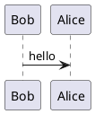
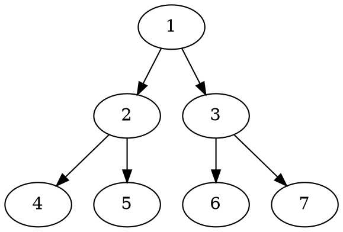
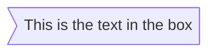

# markdown-it-textual-uml

1. [markdown-it-textual-uml](#markdown-it-textual-uml)
   1. [Overview](#overview)
   2. [UML examples](#uml-examples)
      1. [PlantUML](#plantuml)
      2. [mermaid](#mermaid)
   3. [Installation](#installation)
   4. [Usage](#usage)
   5. [References](#references)
   6. [License](#license)

## Overview

Please note that this project is currently a **work-in-progress**.

Markdown-it markdown parser plugin to create block-level uml diagrams based on textual uml such as plantuml, mermaid, etc.

With this plugin you can create uml diagrams inside your markdown files using various textual uml offering such as plantuml, mermaid, etc.

At this point the following textual uml solutions are supported:

1. [PlantUML](http://plantuml.com/)
2. [mermaid](https://github.com/knsv/mermaid)

## UML examples

### PlantUML

````markdown

````

````markdown

````

### mermaid

````markdown

````

## Installation

node.js, browser:

```text
npm install markdown-it-textual-uml --save
```

## Usage

```javascript
const md = require('markdown-it')()
           .use(require('markdown-it-textual-uml'));
```

Or,

```javascript
import 'markdownItTextualUml from 'markdown-it-textual-uml'
const md = require('markdown-it')()
           .use(markdownItTextualUml);
```

## References

Here are some alternative npm packages:

- [GitHub - gmunguia/markdown-it-plantuml: plantuml diagrams in your markdown](https://github.com/gmunguia/markdown-it-plantuml)
- [GitHub - tylingsoft/markdown-it-mermaid: Mermaid plugin for markdown-it.](https://github.com/tylingsoft/markdown-it-mermaid)
- [GitHub - liradb2000/markdown-it-mermaid: Mermaid plugin for markdown-it.](https://github.com/liradb2000/markdown-it-mermaid)

## License

[MIT](https://github.com/manastalukdar/markdown-it-textual-uml/blob/master/LICENSE)
