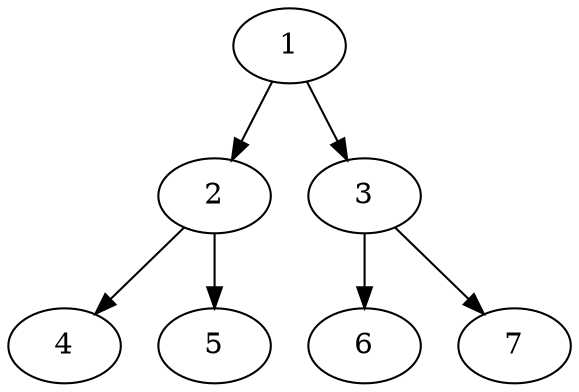

# markdown-it-textual-uml

1. [markdown-it-textual-uml](#markdown-it-textual-uml)
   1. [Overview](#overview)
      1. [Metadata](#metadata)
      2. [Continuous Integration](#continuous-integration)
   2. [UML examples](#uml-examples)
      1. [PlantUML](#plantuml)
      2. [DOT](#dot)
      3. [ditaa](#ditaa)
      4. [mermaid](#mermaid)
   3. [Installation](#installation)
   4. [Usage](#usage)
      1. [Additional steps for mermaid](#additional-steps-for-mermaid)
   5. [Development](#development)
   6. [References](#references)
   7. [License](#license)

## Overview

This is a `markdown-it` markdown parser plugin to create uml diagrams from text, based on plantuml, mermaid, etc.

At this point the following textual uml offerings are supported:

| UML Offering                                                | Markdown fence identifier |
| ----------------------------------------------------------- | ------------------------- |
| [PlantUML](http://plantuml.com/)                            | `plantuml`                |
| [DOT](https://graphviz.gitlab.io/_pages/doc/info/lang.html) | `dot`                     |
| [ditaa](http://ditaa.sourceforge.net/)                      | `ditaa`                   |
| [mermaid](https://github.com/knsv/mermaid)                  | `mermaid`                 |

### Metadata

| Provider                                                               | Data                                | Status                                                                                                                 |
| ---------------------------------------------------------------------- | ----------------------------------- | ---------------------------------------------------------------------------------------------------------------------- |
| [npm](https://www.npmjs.com/package/markdown-it-textual-uml)           | Version                             |                                                            |
| npm                                                                    | License                             |                                                            |
| npm                                                                    | Downloads                           |                                                           |
| BundlePhobia                                                           | Bundle size                         |                                     |
| GitHub                                                                 | Version (package.json)              |      |
| GitHub                                                                 | Repo Size                           |                      |
| GitHub                                                                 | Code Size                           |   |
| GitHub                                                                 | Commit Activity                     |        |
| GitHub                                                                 | Last Commit                         |  |
| GitHub                                                                 | Open Issues                         |                        |
| GitHub                                                                 | Closed Issues                       |                     |
| GitHub                                                                 | Language Count                      |           |
| GitHub                                                                 | License                             |                                  |
| [david-dm](https://david-dm.org/manastalukdar/markdown-it-textual-uml) | Check node.js dependency status     |                                     |
| david-dm                                                               | Check node.js dev dependency status |                            |

### Continuous Integration

| Platform | Provider | Operations | Status |
| -------- | -------- | ---------- | ------ |

## UML examples

### PlantUML

````markdown
```plantuml
Bob -> Alice : hello
```
````

### DOT

````markdown

````

### ditaa

````markdown
```ditaa
+--------+   +-------+    +-------+
|        +---+ ditaa +--> |       |
|  Text  |   +-------+    |diagram|
|Document|   |!magic!|    |       |
|     {d}|   |       |    |       |
+---+----+   +-------+    +-------+
	:                         ^
	|       Lots of work      |
	+-------------------------+
```
````

### mermaid

````markdown

````

## Installation

node.js, browser:

```text
npm install markdown-it-textual-uml --save
```

## Usage

```javascript
const md = require('markdown-it')()
           .use(require('markdown-it-textual-uml'));
```

Or,

```javascript
import 'markdownItTextualUml from 'markdown-it-textual-uml'
const md = require('markdown-it')()
           .use(markdownItTextualUml);
```

### Additional steps for mermaid

For mermaid, you have to include the `mermaid js` file in your application and initialize it **_after_** the window has loaded. Just using this plugin is not enough to ensure that the diagram is rendered correctly.

**Note:** mermaid js has a dependency on the browser window being loaded before it can initialize. Related GitHub [issue](https://github.com/knsv/mermaid/issues/485).

So you should have the following in your html page in order for the mermaid text definitions to be translated into svg.

```html
<script src="mermaid.min.js"></script>
<script>mermaid.initialize({startOnLoad:true});</script>
```

Details [here](https://mermaidjs.github.io/#/usage?id=simple-usage-on-a-web-page).

When using some sort of framework, be aware that `mermaid.initialize` would have to be called after the page has loaded. For example, with vue.js, this could look like:

```javascript
<script>
let mermaid = null
export default {
    mounted() {
        if (mermaid == null) {
        mermaid = require('mermaid')
        }
        mermaid.initialize({
        startOnLoad: true,
        theme: 'forest'
        })
    }
}
</script>
```

## Development

It is highly recommended to use [VS Code](https://code.visualstudio.com/).

## References

Here are some alternative npm packages:

- [GitHub - gmunguia/markdown-it-plantuml: plantuml diagrams in your markdown](https://github.com/gmunguia/markdown-it-plantuml)
- [GitHub - tylingsoft/markdown-it-mermaid: Mermaid plugin for markdown-it](https://github.com/tylingsoft/markdown-it-mermaid)
- [GitHub - liradb2000/markdown-it-mermaid: Mermaid plugin for markdown-it](https://github.com/liradb2000/markdown-it-mermaid)

## License

[MIT](https://github.com/manastalukdar/markdown-it-textual-uml/blob/master/LICENSE)
