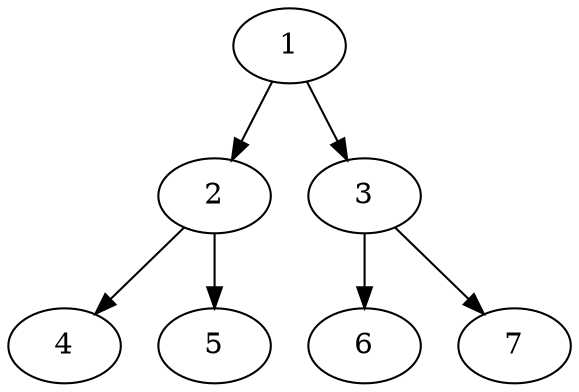

# markdown-it-textual-uml

1. [markdown-it-textual-uml](#markdown-it-textual-uml)
   1. [Overview](#overview)
   2. [UML examples](#uml-examples)
      1. [PlantUML](#plantuml)
      2. [DOT](#dot)
      3. [ditaa](#ditaa)
      4. [mermaid](#mermaid)
   3. [Installation](#installation)
   4. [Usage](#usage)
   5. [References](#references)
   6. [License](#license)

## Overview

[**Note:** This project is currently a **_work-in-progress_**. No npm package has been published yet. The source code is probably broken.]

This is a `markdown-it` markdown parser plugin to create uml diagrams from text, based on plantuml, mermaid, etc.

At this point the following textual uml offerings are supported:

| UML Offering                                                | Markdown fence identifier |
| ----------------------------------------------------------- | ------------------------- |
| [PlantUML](http://plantuml.com/)                            | `plantuml`                |
| [DOT](https://graphviz.gitlab.io/_pages/doc/info/lang.html) | `dot`                     |
| [ditaa](http://ditaa.sourceforge.net/)                      | `ditaa`                   |
| [mermaid](https://github.com/knsv/mermaid)                  | `mermaid`                 |

## UML examples

### PlantUML

````markdown
```plantuml
Bob -> Alice : hello
```
````

### DOT

````markdown

````

### ditaa

````markdown
```ditaa
+--------+   +-------+    +-------+
|        +---+ ditaa +--> |       |
|  Text  |   +-------+    |diagram|
|Document|   |!magic!|    |       |
|     {d}|   |       |    |       |
+---+----+   +-------+    +-------+
	:                         ^
	|       Lots of work      |
	+-------------------------+
```
````

### mermaid

````markdown

````

## Installation

node.js, browser:

```text
npm install markdown-it-textual-uml --save
```

## Usage

```javascript
const md = require('markdown-it')()
           .use(require('markdown-it-textual-uml'));
```

Or,

```javascript
import 'markdownItTextualUml from 'markdown-it-textual-uml'
const md = require('markdown-it')()
           .use(markdownItTextualUml);
```

## References

Here are some alternative npm packages:

- [GitHub - gmunguia/markdown-it-plantuml: plantuml diagrams in your markdown](https://github.com/gmunguia/markdown-it-plantuml)
- [GitHub - tylingsoft/markdown-it-mermaid: Mermaid plugin for markdown-it.](https://github.com/tylingsoft/markdown-it-mermaid)
- [GitHub - liradb2000/markdown-it-mermaid: Mermaid plugin for markdown-it.](https://github.com/liradb2000/markdown-it-mermaid)

## License

[MIT](https://github.com/manastalukdar/markdown-it-textual-uml/blob/master/LICENSE)
