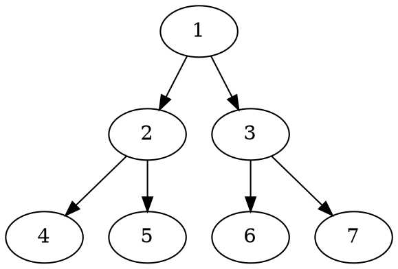

# markdown-it-textual-uml

1. [Overview](#overview)
2. [UML examples](#uml-examples)
   1. [PlantUML](#plantuml)
   2. [DOT](#dot)
   3. [ditaa](#ditaa)
   4. [mermaid](#mermaid)
3. [Installation](#installation)
4. [Usage](#usage)
   1. [Additional steps for mermaid](#additional-steps-for-mermaid)
5. [Development](#development)
6. [References](#references)
7. [License](#license)

## Overview

[](https://www.npmjs.com/package/markdown-it-textual-uml)


[](https://github.com/marketplace/actions/super-linter)

[More project metadata badges [here](./documentation/project/metadata.md). More CI/CD badges [here](./documentation/development/ci-cd.md#current-status).]

This is a `markdown-it` markdown parser plugin to create uml diagrams from text, based on plantuml, mermaid, etc.

At this point the following textual uml offerings are supported:

| UML Offering                                                | Markdown fence identifier |
| ----------------------------------------------------------- | ------------------------- |
| [PlantUML](http://plantuml.com/)                            | `plantuml`                |
| [DOT](https://graphviz.gitlab.io/_pages/doc/info/lang.html) | `dot`                     |
| [ditaa](http://ditaa.sourceforge.net/)                      | `ditaa`                   |
| [mermaid](https://github.com/knsv/mermaid)                  | `mermaid`                 |

## UML examples

### PlantUML

````markdown
```plantuml
Bob -> Alice : hello
```
````

### DOT

````markdown

````

### ditaa

````markdown
```ditaa
+--------+   +-------+    +-------+
|        +---+ ditaa +--> |       |
|  Text  |   +-------+    |diagram|
|Document|   |!magic!|    |       |
|     {d}|   |       |    |       |
+---+----+   +-------+    +-------+
  :                         ^
  |       Lots of work      |
  +-------------------------+
```
````

### mermaid

````markdown

````

## Installation

node.js, browser:

```text
npm install markdown-it-textual-uml --save
```

## Usage

```javascript
const md = require('markdown-it')()
           .use(require('markdown-it-textual-uml'));
```

Or,

```javascript
import 'markdownItTextualUml from 'markdown-it-textual-uml'
const md = require('markdown-it')()
           .use(markdownItTextualUml);
```

### Additional steps for mermaid

For mermaid, you have to include the `mermaid js` file in your application and initialize it **_after_** the window has loaded. Just using this plugin is not enough to ensure that the diagram is rendered correctly.

**Note:** mermaid js has a dependency on the browser window being loaded before it can initialize. Related GitHub [issue](https://github.com/knsv/mermaid/issues/485).

So you should have the following in your html page in order for the mermaid text definitions to be translated into svg.

```html
<script src="mermaid.min.js"></script>
<script>mermaid.initialize({startOnLoad:true});</script>
```

Details [here](https://mermaidjs.github.io/#/usage?id=simple-usage-on-a-web-page).

When using some sort of framework, be aware that `mermaid.initialize` would have to be called after the page has loaded. For example, with vue.js, this could look like:

```javascript
<script>
let mermaid = null
export default {
    mounted() {
        if (mermaid == null) {
        mermaid = require('mermaid')
        }
        mermaid.initialize({
        startOnLoad: true,
        theme: 'forest'
        })
    }
}
</script>
```

## Development

It is highly recommended to use [VS Code](https://code.visualstudio.com/).

I have an open issue to make development, testing and deployments easier but for now following steps have to be followed:

1. Make changes in this project.
2. Update version in package.json.
3. `npm run build`
4. `npm run pack`
5. In a separate test project that includes this npm package:
   1. Change the entry in its package.json to: `"markdown-it-textual-uml": "file:./markdown-it-textual-uml-0.1.3.tgz"`. Change version (last released version) to version from step 2.
   2. Run `npm cache clean --force`.
   3. Delete its package-lock.json.
   4. Delete folder for `markdown-it-textual-uml` from within the node_modules folder.
   5. Run `npm install`.

Once we have the changes tested out, revert back all changes in the test project.

Now, in this project:

1. Run `npm run publish`.
   1. <https://simplernerd.com/update-published-npm-package/>
2. Merge `develop` to `main` using Github PR.
3. Create a GitHub release with the semantically versioned tag against `main`.
4. Pull repo to local (optional) if you have `main` branch locally.

## References

Here are some alternative npm packages:

- [GitHub - gmunguia/markdown-it-plantuml: plantuml diagrams in your markdown](https://github.com/gmunguia/markdown-it-plantuml)
- [GitHub - tylingsoft/markdown-it-mermaid: Mermaid plugin for markdown-it](https://github.com/tylingsoft/markdown-it-mermaid)
- [GitHub - liradb2000/markdown-it-mermaid: Mermaid plugin for markdown-it](https://github.com/liradb2000/markdown-it-mermaid)

## License

[MIT](https://github.com/manastalukdar/markdown-it-textual-uml/blob/main/LICENSE)
